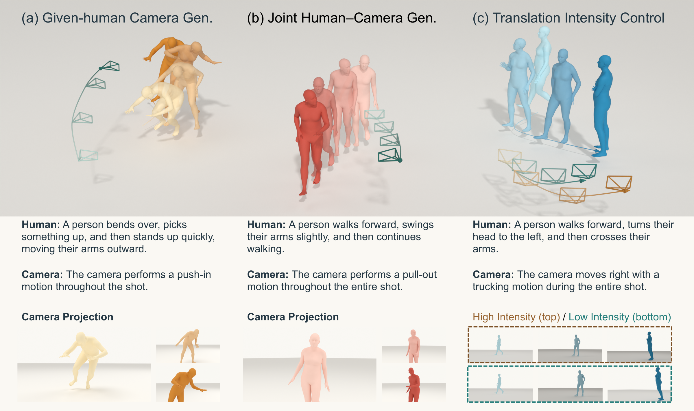

# AESOP: Asymmetric Human–Camera Generation with Translation-Intensity Control

**Jingzhong Lin1,*, Zhanke Wang2, Heng Li3, Wenxiang Liu1,**  
**Zhao Zhang1, Kecheng Tang1, Dongdong Xiang1, Changbo Wang1,**  
**Di Kang4, Chunchao Guo4, Linchao Bao4, Gaoqi He1,†**

1 East China Normal University &nbsp; 2 Peking University  
3 Sun Yat-sen University &nbsp; 4 Tencent

* This work was completed during an internship at Tencent.  
† Corresponding author.

## Coming soon

Code coming soon.
